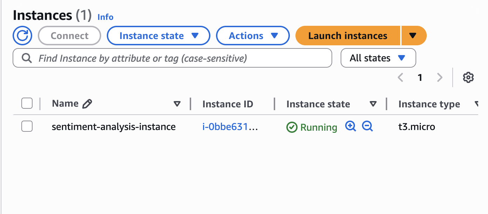

# Sentiment Analysis Deployment on AWS EC2

---

### **DESCRIPTION**

This project deploys a complete sentiment analysis system on an AWS EC2 instance using Docker containers. It includes two main services running on the EC2 server:

- **FastAPI Backend:** Serves sentiment prediction requests.
- **Streamlit Monitoring Dashboard:** Visualizes prediction logs and model performance metrics.

The two services run in separate Docker containers sharing a volume for logs, enabling communication. The EC2 instance acts as the host for these containers, allowing remote access via the public IP.

---

### **SYSTEM ARCHITECTURE**

| Component           | Description                                                  |
|---------------------|--------------------------------------------------------------|
| AWS EC2 Instance    | Ubuntu server hosting Docker containers                      |
| Docker             | Containerizes the FastAPI and Streamlit apps                 |
| Docker Volume      | Shared log volume mounted to both containers                 |
| Security Groups    | Configured to allow ports 8000 (API) and 8501 (Streamlit)    |

---

### **PROJECT STRUCTURE**

| File/Folder          | Purpose                                               |
|---------------------|-------------------------------------------------------|
| `api/`              | FastAPI application serving sentiment predictions     |
| `monitoring/`       | Streamlit dashboard for monitoring logs and metrics   |
| `logs/`             | Shared directory for prediction logs                   |
| `Makefile`          | Automates Docker build, run, and cleanup tasks         |
| `evaluate.py`       | Script to test API predictions and collect feedback    |
| `test.json`         | Sample test data used by `evaluate.py`                  |
| `README.md`         | Project documentation                                   |

---

### **DEPLOYMENT ON AWS EC2**

#### Setup Summary:

1. Launched Ubuntu EC2 instance with proper security group rules:
   - Port 22 open for SSH (your IP only recommended)
   - Port 8000 open for FastAPI
   - Port 8501 open for Streamlit

2. Connected via SSH using the PEM key.

3. Installed Docker, Git, and other dependencies.

4. Cloned the repo and built Docker images:
   ```bash
   make build-api
   make build-monitor
   ```

5. Run the containers (Makefile updated from previous assignemnt to run in detached mode).

    ```bash
    make run-api
    make run-monitor
    ```

6. To access the FastAPI and the Streamlit dashboard:
- FastAPI docs at ```http://<EC2-Public-IP>:8000/docs```
- Streamlit dashboard at ```http://<EC2-Public_IP>:8501```


### **FastAPI SERVICE**

| Method | Endpoint         | Description                                             |
|--------|------------------|---------------------------------------------------------|
| GET    | `/health`        | Returns `"status": "ok"` to verify the service is live |
| POST   | `/predict`       | Accepts text and returns sentiment prediction          |

Example POST /predict payload:

```json
{
    "text": "I love this movie!",
    "true_sentiment": "positive"
}
```

Example response:

```json
{
    "predicted_sentiment": "positive"
}
```
Logs every request with timestamp, input text, prediction, and true sentiment to shared volume.

---

### **STREAMLIT MONITORING DASHBOARD**

Available at ``` http://<EC2-Public-IP>:8501```

This dashboard reads from **logs/prediction_logs.json** and displays:

#### Data Drift Analysis:
- Compares sentence lengths from training data vs logged requests.

#### Target Drift:
- Compares sentiment distribution in predictions vs original dataset.

#### Model Performance:
- Calculates **accuracy** and **precision** from logged feedback.

#### Alerts:
- Displays warning if accuracy falls below 80%.


---

### HOW TO RUN LOCALLY ON EC2

## Launching an EC2 Instance

To deploy this project, you need to launch and configure an **AWS EC2 instance**. Here's a quick overview of the process:

### 1. Launch a New EC2 Instance

- Go to the AWS EC2 Console
- Click **Launch Instance**
- Choose **Amazon Linux 2023** (or Ubuntu if you prefer)
- Instance type: `t3.micro` (free tier eligible)
- Click **Next** until you get to security group settings



### 2. Configure the Security Group

Create or edit the security group to allow traffic on:

| Port  | Protocol | Source              | Purpose                      |
|-------|----------|----------------------|------------------------------|
| 22    | TCP      | Your IP only         | SSH access                   |
| 8000  | TCP      | Anywhere (0.0.0.0/0) | FastAPI service              |
| 8501  | TCP      | Anywhere (0.0.0.0/0) | Streamlit dashboard          |

restricting to My IP is safer


### 3. Key Pair Setup

- When launching, **create or select a key pair** (e.g., `labsuser.pem`)
- Download the `.pem` file and store it safely

### 4. Finalize & Launch

- Click **Launch Instance**
- Once running, note the **Public IPv4 address** — this is needed for SSH and web access

---

## Connect to Your EC2 Instance via SSH

### 1. Open Terminal and Navigate to the Key File

Make sure your `.pem` file is in your current directory or provide the full path to it.

Run:

```bash
chmod 400 labsuser.pem
```

This sets the correct permissions so SSH will use it.

### 2. Connect via SSH

```bash
ssh -i labsuser.pem ec2-user@<your-ec2-public-ip>
```

Example:

```bash
ssh -i labsuser.pem ec2-user@3.90.42.193
```

If you're using Ubuntu instead of Amazon Linux:

```bash
ssh -i labsuser.pem ubuntu@<your-ec2-public-ip>
```


---

## Install Docker & Git on Amazon Linux 2023

Once connected to your EC2 instance:

```bash
# Update packages
sudo dnf update -y

# Install Docker
sudo dnf install -y docker
sudo systemctl start docker
sudo sytemctl enable docker

# Install Git
sudo dnf install -y git
```
I recommend checking to be sure Docker and Git are installed successfully by running
```bash
sudo docker --version
git --version
```

### **CI/CD PIPELINE: GITHUB ACTIONS**

This project uses **GitHub Actions** for continuous integration. Every time code is pushed to the `main` branch, the workflow in `.github/workflows/ci.yml` runs these steps:

- Checks out the repo  
- Sets up Python  
- Installs dependencies from `requirements.txt`  
- Runs **linter** (`flake8` or `ruff`)  
- Runs **tests** (with `pytest`)

You can see the status of these checks on the GitHub repository under the **Actions** tab and even click on them for more detailed progress.

---

### **RUN LOCALLY (Optional)**

If you want to run the project on your local machine instead of EC2:

1. Install Docker  
2. Clone the repository  
3. Build the images:

```bash
make build-api
make build-monitor
```

4. Run both services:

```bash
make run-api
make run-monitor
```

5. Open in browser:

- FastAPI: http://localhost:8000/docs  
- Streamlit: http://localhost:8501

You should see something like the following in the browser:


You can also test it like this too:


You can also run ```sudo docker ps``` to see that the containers are up and running

---

### **TESTING**

The project includes basic tests written using **pytest**:

- `api/test_api.py` — tests `/predict` and `/health` endpoints for valid and invalid requests
- `monitoring/test_dashboard.py` — checks that the Streamlit dashboard starts successfully

To run all tests locally:

```bash
pytest
```

These tests are automatically run in the CI pipeline on every push.

---

### **NOTES**

- The application assumes log persistence via Docker bind mount to `/logs`.
- Be sure to configure the security group correctly, otherwise you won’t be able to reach your services -- ports 8000 and 8501 
- No frontend UI — predictions should be tested using tools like Postman or `curl`.
